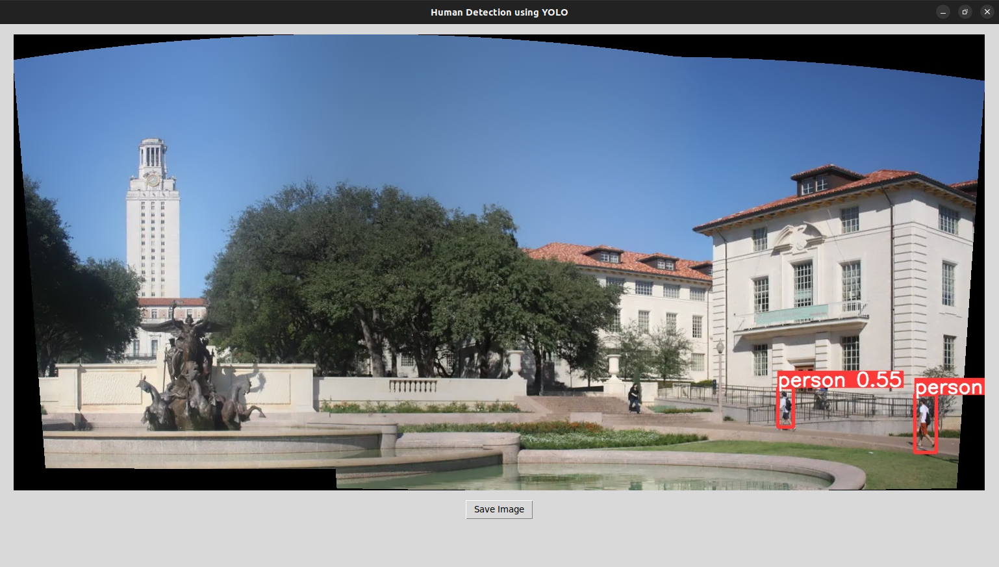
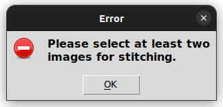

# Final Project
# Project Document: AI-Enhanced Image Stitching and Edge Detection

## Goal
The goal of this project is to develop an application that allows users to select a group of images, which the application will then stitch together into a single panoramic image. This stitched image will undergo multiple edge detection processes using different techniques: Canny Edge Detection, Difference of Gaussians (DoG) with an adjustable morphological operation, and an AI-based edge
detector specifically tuned to recognize human figures with a confidence level of more than 50%.

The application will provide an interactive interface for users to adjust parameters and visually compare the results of different edge detection techniques.

## Requirements
### Functional Requirements:

**Image Selection and Stitching:**

* The application must include a user interface (UI) component to allow users to select a group of images from their computer.

* Stitch the selected images into a single panoramic image.

* Display both the individual images and the stitched panoramic image within the application on a first window.

**Edge Detection Implementation:**

* Apply Canny Edge Detection to the stitched image and display the result.

* Implement Difference of Gaussians (DoG) edge detection followed by a morphological operation to clean the results.

* Provide a user interface component (e.g., a slider) to adjust the kernel size of the morphological operation. The kernel shape can be any form selected by the developer.

* Display both results and the slider on a second window.

**AI-based Human Edge Detection:**

* Implement an AI-based object detection model capable of identifying human figures within the stitched image.

* The model should filter and display only those detections with a confidence level above 50%.

* The results should be visually represented on the stitched image, clearly marking detected human figures on a third window.

**User Interface:**

* Develop a simple, intuitive user interface that allows users to upload images, view processed results, and adjust Morphological Operations’ parameters dynamically.

## Non-functional Requirements:

**Performance**: The application should process images and perform edge detection efficiently, ensuring a responsive user experience.

**Usability**: The interface should be user-friendly, with clear instructions and feedback for users to easily navigate and use the application's features.

**Scalability**: The design should accommodate future enhancements, such as the addition of new edge detection algorithms or support for larger image sets.

----
## Screenshots for the Project (PixCraft)

### Welcome Screen

<picture>
  
</picture>

### Selecting Images from PC

<picture>
  
</picture>

### Generate Stitched Image with Available Operations

<picture>
  
</picture>

### Canny Edge Detection

<picture>
  
</picture>

### DoG with Morphological Operation and Kernel Slider

<picture>
  
</picture>

### DoG Edge Detection

<picture>
  
</picture>

### HSV Color Model

<picture>
  
</picture>

### Human Detection using YOLO v8.1

<picture>
  
</picture>

### Warning, Error and Informational Messages

<picture>
  
</picture>

<picture>
  
</picture>

<picture>
  
</picture>

